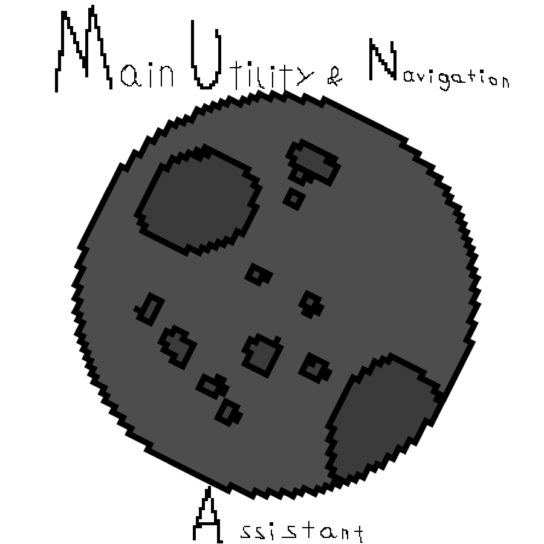

# M.U.N.A. - Main Utility & Navigation Analyzer




Hey there, Commander.

So you want to know what M.U.N.A. is? Picture this: you're floating somewhere above Kerbin, your fuel tank is making funny noises, and you're wondering if you actually have enough delta-v to make it home. Normally you'd pull out a calculator, open a spreadsheet, or just wing it like Jeb usually does.

Or... you could just ask M.U.N.A.

## What is this thing?

M.U.N.A. is your ship's AI companion. Think of it like having a paranoid flight computer that actually talks back to you. It reads your telemetry, analyzes your situation, and tells you what's going on in plain English (or whatever language the AI feels like using that day).

The twist? M.U.N.A. has two distinct personalities:

**Rockomax Mode (Easy/Normal)** - Your reliable corporate buddy. Professional, enthusiastic about safety protocols, and genuinely concerned when you're about to crash. This is the version that pays its taxes and files expense reports.

**Jeb's Junk Mode (Hard)** - The version assembled at 3 AM in a garage using parts from exploded rockets. Emotionally unstable, prone to panic attacks, and weirdly proud of being held together by duct tape. Might give you advice. Might have an existential crisis. You never know.

## How do I use it?

Every command pod and probe core in the game can have M.U.N.A. installed (thanks to ModuleManager magic). But here's the catch: **you have to buy it first.**

Right-click your capsule in flight and you'll see purchase options:

**"Purchase M.U.N.A. Basic"** - The entry-level package. Cheaper, gets you telemetry and procedural reports. Think of it as the budget option from Jebediah Junk Co.

**"Purchase M.U.N.A. Full"** - The premium experience. More expensive, includes full AI integration with Groq. This is the Rockomax treatment.

**Upgrade Path:** Already bought Basic? You can upgrade to Full for 60% of the full price. We respect early adopters.

Once installed, you'll get:

**"Analyze with M.U.N.A."** - Gets you a standard telemetry report. The AI looks at your speed, altitude, fuel levels, and tells you what's up.

**"Ask M.U.N.A. a Question..."** - This is where it gets fun. You can literally type anything:

- "Can I reach the Mun with this fuel?"
- "Should I be worried about my altitude?"
- "What would Jeb do?"

The AI uses Groq (that's a real API - think ChatGPT but faster) to answer you in character. If you're in Hard mode, expect answers that are... creatively accurate.

### Costs (Career Mode)

Prices depend on your game difficulty:

| Difficulty | Basic       | Full         | Reactivation |
|------------|-------------|--------------|--------------|
| Easy       | 2,500 Funds | 8,000 Funds  | 500 Funds    |
| Normal     | 8,000 Funds | 25,000 Funds | 500 Funds    |
| Hard       | 20,000 Funds| 60,000 Funds | 500 Funds    |

*Sandbox mode: Everything is free. Because sandbox.*

## The "Creative Mode" Checkbox

There's a little checkbox labeled "Creative/Misinformation Mode" when you ask questions. What does it do?

**Rockomax + Creative Mode:** Your corporate AI has been instructed by management to "think outside the box." It rounds success probabilities UP. An 84% chance becomes "basically 100%." Problems become "opportunities for rapid unplanned disassembly learning."

**Jeb's Junk + Creative Mode:** Complete chaos. The AI believes Kerbin is flat (or triangular?), that the Mun is made of cheese, and that Jeb is a god. It invents physics. It makes up technical terms. It's beautiful nonsense.

Use at your own risk.

## Installation

1. Drop the MUNA folder into your GameData directory
2. Make sure you have ModuleManager installed (it's not optional, MUNA won't work without it)
3. If you want the AI features, create a file at `GameData/MUNA/muna_settings.cfg` with your Groq API key:   (This is optional, if you enter the game, launch a vessel, click the M.U.N.A. icon and press a grey button in the upper right corner, you can put the api Key, model and if you want to use Groq, if you want to manually make the file, do it, if not, do the above steps)

```cfg
MUNA_SETTINGS
{
    apiKey = your_groq_api_key_here
    model = llama3-8b-8192
    useGroq = True
}
```

Don't have a Groq key? Get one free at console.groq.com. Or don't - the mod works fine without it, you'll just get procedural reports instead of AI responses.

## What's included?

- **ModuleMunaCore.cs** - The main brain
- **MunaAppLauncher.cs** - The GUI window that pops up when you click the app launcher button
- **999_MUNA_Core.cfg** - ModuleManager patches that install MUNA on every command pod
- Some icons that look suspiciously like they were made at 3 AM in a 1 hour limit (they were)

## Requirements

- Kerbal Space Program 1.12.x (probably works on earlier versions but who's counting)
- ModuleManager (seriously, you need this)
- Optional: A sense of humor and Groq API key for AI features

## Known Issues

- The AI sometimes lies to you (especially in Creative Mode - that's literally the point)
- Hard mode glitches can trigger even when you don't want them to (also the point)
- We are not responsible for any RUD caused by following MUNA's advice
- M.U.N.A. can possibly explode with you and your capsule if you dont

## Credits

Made by someone who thought KSP needed more talking computers with emotional baggage.

Special thanks to:

- The KSP modding community for not laughing (too hard) at my code

- Jeb, for the inspiration

- Rockomax, for the funding (they didn't actually fund this)

## License

MIT License. Do whatever you want. If you make it better, let me know. If you make it worse, I don't want to know.

"M.U.N.A. - Because flying a rocket made of parts you bolted together in a garage should feel exactly as **sketchy** as it actually is."
